# 🔥 printf() - The Ultimate Custom Implementation 🔥

<div align="center">


**The most EPIC printf reimplementation you've ever seen!** 🚀

*Created by the legendary duo: **Aljawharah** & **Manar** from Saudi Cohort 4* 🇸🇦

</div>

---

## 🎯 Table of Contents

- [🎮 Quick Start](#-quick-start)
- [🏗️ Architecture](#️-architecture)
- [🎨 Visual Flow](#-visual-flow)
- [📋 Format Specifiers](#-format-specifiers)
- [⚡ Features](#️-features)
- [🔧 Technical Details](#-technical-details)
- [🚀 Usage Examples](#-usage-examples)
- [📚 Man Page](#-man-page)
- [👥 Contributors](#-contributors)

---

## 🎮 Quick Start

> **Ready to witness C magic?** Follow these simple steps!

```bash
# Clone the repository
git clone https://github.com/mnarzaid247-stack/holbertonschool-printf.git
cd holbertonschool-printf

# Compile and run
gcc -Wall -Werror -Wextra -pedantic -std=gnu89 -Wno-format *.c -o printf_test
./printf_test
```

---

## 🏗️ Architecture

### Project Structure

```
printf_project/
├── _printf.c            # Main printf function implementation
│   └── format_handler.c # Format specifier dispatcher
├── specifiers/          # Individual format handlers
│   ├── print_string.c
│   ├── print_int.c
│   ├── print_char.c
│   ├── print_binary.c
│   ├── print_octal.c
│   ├── print_upper.c
|   |__ print_lower.c
│   └── print_unsigned.c
├── buffer_funcs.c      # Buffered I/O management
├── main.h              # Header file with all declarations
└── man_3_printf/       # Documentation
```

### Core Components Flow

1. **_printf()**: Main entry point, orchestrates the formatting process
2. **format_handler()**: Routes to appropriate specifier handler based on format table
3. **Individual handlers**: Each handles a specific format type (string, int, char, etc.)
4. **buffered_write()**: Efficient character output management with 1024-char buffer

---

## 🎨 Visual Flow

```mermaid
graph TD
    A[🚀 User calls _printf] --> B[📝 Parse format string]
    B --> C{🔍 Encounter '%'?}
    C -->|No| D[📤 Print literal text]
    D --> E{🎯 More characters?}
    E -->|Yes| B
    E -->|No| F[✅ Write buffer to stdout]
    C -->|Yes| G[🎯 Format Handler]
    G --> H[📋 Check specifier table]
    H --> I{Select handler}
    I -->|s| J[📝 Print String]
    I -->|c| K[🔤 Print Character]
    I -->|d/i| L[🔢 Print Integer]
    I -->|b| M[💾 Print Binary]
    I -->|o| N[🎯 Print Octal]
    I -->|x| O[🔢 Print Hex Lower]
    I -->|X| P[🔢 Print Hex Upper]
    I -->|u| Q[🔢 Print Unsigned]
    I -->|% | R[📤 Print Percent]
    J --> S[📦 Buffer Writer]
    K --> S
    L --> S
    M --> S
    N --> S
    O --> S
    P --> S
    Q --> S
    R --> S
    S --> T{Buffer full?}
    T -->|Yes| U[📤 Flush to stdout]
    T -->|No| E
    U --> E
    F --> V[🎉 Done!]
```



---

## 📋 Format Specifiers

| Specifier | Description | Example | Output |
|-----------|-------------|---------|---------|
| `%s` | String | `_printf("Hello %s", "World")` | Hello World |
| `%c` | Character | `_printf("Char: %c", 'A')` | Char: A |
| `%d` | Signed integer | `_printf("Num: %d", 42)` | Num: 42 |
| `%i` | Signed integer | `_printf("Num: %i", -10)` | Num: -10 |
| `%u` | Unsigned integer | `_printf("Unsigned: %u", -42)` | Unsigned: 4294967254 |
| `%o` | Octal | `_printf("Oct: %o", 64)` | Oct: 100 |
| `%x` | Hexadecimal (lowercase) | `_printf("Hex: %x", 255)` | Hex: ff |
| `%X` | Hexadecimal (uppercase) | `_printf("Hex: %X", 255)` | Hex: FF |
| `%b` | Binary | `_printf("Bin: %b", 15)` | Bin: 1111 |
| `%%` | Percent sign | `_printf("Percent: %%")` | Percent: % |

### Interactive Demo Section

```c
// Try these examples to see our implementation in action!
_printf("Name: %s\n", "Aljawharah");              // String
_printf("Age: %d\n", 25);                         // Integer
_printf("Grade: %c\n", 'A');                      // Character
_printf("Binary: %b\n", 15);                      // Binary
_printf("Octal: %o\n", 64);                       // Octal
_printf("Hex: %x\n", 255);                        // Hex lowercase
_printf("Hex: %X\n", 255);                        // Hex uppercase
_printf("Unsigned: %u\n", -42);                   // Unsigned
_printf("Special: %%\n");                         // Percent
```

---

## ⚡ Features

### ✨ What Makes This Special?

- 🎯 **Efficient Buffer Management**: 1024-character buffer for optimal performance
- 🔧 **Extensible Architecture**: Easy to add new format specifiers
- 📋 **Format Handler Table**: Clean dispatching mechanism
- 🛡️ **Type Safety**: Proper handling of different data types
- 📦 **Memory Efficient**: Stack-based buffer management
- 🎨 **Clean Code**: Well-documented and organized structure

### 🚀 Performance Optimizations

- **Buffered I/O**: Reduces system calls for better performance
- **Minimal Mallocs**: Efficient memory usage
- **Early Returns**: Optimized control flow
- **Stack Allocation**: Fast buffer operations

---

## 🔧 Technical Details

### Format Handler Table Implementation

```c
typedef struct {
    char type;                                    // Format specifier character
    int (*func)(va_list args, char buffer[], int buffer_pos);  // Handler function
} format_handler_t;

// Our powerful dispatcher table!
static const type_t table[] = {
    {'s', print_string},      // String printing
    {'d', print_int},         // Signed decimal
    {'c', print_char},        // Character
    {'%', print_percent},     // Percent sign
    {'i', print_int},         // Signed integer (same as %d)
    {'b', print_binary},      // Binary representation
    {'u', print_unsigned},    // Unsigned integer
    {'o', print_octal},       // Octal representation
    {'x', print_lower},       // Hex lowercase
    {'X', print_upper},       // Hex uppercase
    {'/0', NULL}              // Terminator
};
```

### Buffer Management System

```c
// Buffer configuration
#define BUFFER_SIZE 1024

// Core buffer functions
void flush_buffer(void);
void buffered_write(char c);
```

### Error Handling

- ✅ Proper return values for successful operations
- 🛡️ Buffer overflow protection
- 📝 Null pointer safety checks
- 🎯 Format string validation

---

## 🚀 Usage Examples

### Basic Examples

```c
#include "printf.h"

int main() {
    // String formatting
    _printf("Name: %s\n", "Aljawharah");
    
    // Number formatting
    _printf("Age: %d\n", 25);
    _printf("Hex: %x\n", 255);
    _printf("Binary: %b\n", 15);
    
    // Mixed formatting
    _printf("Student: %s, Age: %d, Grade: %c\n", 
            "Manar", 99, 'A');
    
    return 0;
}
```

### Advanced Examples

```c
// Complex formatting
_printf("Welcome %s from %s Cohort %d!\n", 
        "Aljawharah", "Saudi", 4);

// Multiple bases demonstration
int num = 64;
_printf("Number %d in different bases:\n", num);
_printf("  Decimal: %d\n", num);
_printf("  Octal: %o\n", num);
_printf("  Hex: %x\n", num);
_printf("  Binary: %b\n", num);

// Edge cases
_printf("Special chars: %c %c %c\n", '%', '\n', '\t');
_printf("Negative: %d\n", -12345);
_printf("Zero: %d\n", 0);
_printf("Max unsigned: %u\n", 4294967295);
```

### Real-World Scenarios

```c
// File operations logging
_printf("Processing file: %s\n", filename);
_printf("Lines read: %d\n", line_count);
_printf("Size: %u bytes\n", file_size);

// Debugging output
_printf("Function: %s\n", function_name);
_printf("Line: %d\n", __LINE__);
_printf("Binary mask: %b\n", 0xFF);

// Educational displays
_printf("Number %d breakdown:\n", num);
_printf("  Binary: %b\n", num);
_printf("  Octal: %o\n", num);
_printf("  Hex: %x\n", num);
```

---

## 📚 Man Page

We're have an epic man page (`_printf.3`) that cover:

- 📋 **Complete function reference**
- 🎯 **Format specifier details**  
- ⚡ **Performance characteristics**
- 🔧 **Implementation notes**
- 📝 **Comprehensive usage examples**
- 🐛 **Error handling documentation**
- 🔬 **Internal architecture deep dive**
---

## 👥 Contributors

<div align="center">

### 🎨 **The Dream Team**

<table>
<tr>
<td align="center" width="50%">
<div style="background: linear-gradient(135deg, #667eea 0%, #764ba2 100%); padding: 25px; border-radius: 15px; color: white; margin: 10px;">
<div style="font-size: 80px; margin-bottom: 15px;">👩‍💻</div>
<h3>Manar</h3>
<p><strong>Format Handler Specialist</strong></p>
<p>🎯 Master of format specifiers<br>⚙️ Architecture design expert<br>📊 Code optimization guru</p>
<div style="background: rgba(255,255,255,0.2); padding: 8px; border-radius: 20px; margin-top: 15px; display: inline-block;">
🇸🇦 Saudi Cohort 4
</div>
</div>
</td>
<td align="center" width="50%">
<div style="background: linear-gradient(135deg, #f093fb 0%, #f5576c 100%); padding: 25px; border-radius: 15px; color: white; margin: 10px;">
<div style="font-size: 80px; margin-bottom: 15px;">👩‍💻</div>
<h3>Ajawharah</h3>
<p><strong>Buffer Management Expert</strong></p>
<p>📦 I/O buffer wizard<br>🔧 System-level programming pro<br>🚀 Performance optimization master</p>
<div style="background: rgba(255,255,255,0.2); padding: 8px; border-radius: 20px; margin-top: 15px; display: inline-block;">
🇸🇦 Saudi Cohort 4
</div>
</div>
</td>
</tr>
</table>

</div>

### 🎓 Educational Journey

<div style="background: #f8f9fa; padding: 25px; border-radius: 15px; text-align: center; margin: 30px 0;">

<h3>🏫 Educational Institution</h3>
<p style="font-size: 1.5em; margin: 10px 0;"><strong>Holberton School - Tuwaiq Academy</strong></p>
<p style="font-size: 1.2em;">🇸🇦 Saudi Arabia | Cohort 4</p>

<div style="margin-top: 25px;">
<span style="background: #007bff; color: white; padding: 8px 15px; border-radius: 25px; margin: 5px; font-weight: bold;">C Programming</span>
<span style="background: #28a745; color: white; padding: 8px 15px; border-radius: 25px; margin: 5px; font-weight: bold;">Systems Programming</span>
<span style="background: #dc3545; color: white; padding: 8px 15px; border-radius: 25px; margin: 5px; font-weight: bold;">Low-level Programming</span>
<span style="background: #6f42c1; color: white; padding: 8px 15px; border-radius: 25px; margin: 5px; font-weight: bold;">Data Structures</span>
</div>

</div>

### 🤝 Team Contributions

**Manar's Specialties:**
- 🎯 Format handler table implementation
- 🔢 Integer and string formatting logic
- 🏗️ Code architecture and structure

**Aljawharah's Specialties:**
- 📦 Buffer management system design
- 🔧 System-level I/O operations
- 📝 Documentation and code comments


---

## 🏆 Project Achievements

<div style="display: grid; grid-template-columns: repeat(auto-fit, minmax(250px, 1fr)); gap: 20px; margin: 30px 0;">

<div style="background: linear-gradient(135deg, #667eea 0%, #764ba2 100%); padding: 25px; border-radius: 15px; color: white; text-align: center;">
<div style="font-size: 60px; margin-bottom: 15px;">✅</div>
<h3>10 Format Specifiers</h3>
<p>Complete implementation of major printf format types</p>
</div>

<div style="background: linear-gradient(135deg, #f093fb 0%, #f5576c 100%); padding: 25px; border-radius: 15px; color: white; text-align: center;">
<div style="font-size: 60px; margin-bottom: 15px;">⚡</div>
<h3>Buffered I/O</h3>
<p>Efficient 1024-character buffer management</p>
</div>

<div style="background: linear-gradient(135deg, #4facfe 0%, #00f2fe 100%); padding: 25px; border-radius: 15px; color: white; text-align: center;">
<div style="font-size: 60px; margin-bottom: 15px;">🏗️</div>
<h3>Clean Architecture</h3>
<p>Modular design with clear separation of concerns</p>
</div>

<div style="background: linear-gradient(135deg, #43e97b 0%, #38f9d7 100%); padding: 25px; border-radius: 15px; color: white; text-align: center;">
<div style="font-size: 60px; margin-bottom: 15px;">📚</div>
<h3>Documentation</h3>
<p>Comprehensive README man page</p>
</div>

</div>

---

## 🔮 Future Enhancements

<div style="background: linear-gradient(135deg, #667eea 0%, #764ba2 100%); padding: 25px; border-radius: 15px; color: white; margin: 30px 0;">

<h3>🚀 Roadmap for Future Versions</h3>

<ul style="margin-left: 20px; line-height: 2;">
<li>📐 <strong>Width and Precision</strong>: Support for format modifiers (%.2f, %10s, etc.)</li>
<li>📍 <strong>Address Printing</strong>: Pointer address formatting</li>
<li>🔤 <strong>Case Modifiers</strong>: Upper/lower case string formatting</li>
<li>🎯 <strong>Custom Specifiers</strong>: User-defined format handlers</li>
<li>📊 <strong>Performance Metrics</strong>: Timing and efficiency measurements</li>
<li>🧪 <strong>Unit Tests</strong>: Comprehensive test suite with all edge cases</li>
<li>📱 <strong>Memory Debugging</strong>: Valgrind integration and memory leak detection</li>
</ul>

</div>

---

## 🏁 Getting Started

<div style="background: linear-gradient(135deg, #667eea 0%, #764ba2 100%); padding: 30px; border-radius: 15px; color: white; text-align: center;">

<h2>🌟 Ready to See the Magic? 🌟</h2>

<p style="font-size: 1.2em; margin: 20px 0;">Explore the code and witness the power of custom printf implementation!</p>

```bash
# Clone and start your journey
git clone https://github.com/mnarzaid247-stack/holbertonschool-printf.git
cd holbertonschool-printf

# Compile with all warnings enabled
gcc -Wall -Werror -Wextra -pedantic -std=gnu89 -Wno-format *.c -o printf_test

# Run the test suite
./printf_test
```

<div style="margin-top: 25px; font-size: 1.1em;">
<strong>⚡ Pro Tip:</strong> Try running the examples in the Usage section to see each format specifier in action!
</div>

</div>

---

## 📝 License & Credits

<div style="background: #f8f9fa; padding: 25px; border-radius: 10px; text-align: center;">

<p><strong>Educational Project</strong> | Holberton School | Tuwaiq Academy</p>
<p>This project is part of the Holberton School curriculum and serves as a learning exercise in C programming and systems development.</p>

<p><em>"Made with ❤️ by Aljawharah & Manar | Saudi Cohort 4"</em></p>

<p style="margin-top: 20px; font-style: italic;">*"Turning C code into art, one format specifier at a time!"* 🎨</p>

</div>

---

<div style="text-align: center; margin-top: 40px; padding: 20px; background: #333; color: white; border-radius: 10px;">

**Thank you for exploring our printf implementation!** 🙏

*Special thanks to Holberton School, Tuwaiq Academy, and our amazing cohort mates and mentors for the support and collaboration.*

**🇸🇦 Saudi Cohort 4 | Tuwaiq Academy | Holberton School**

</div>

---
